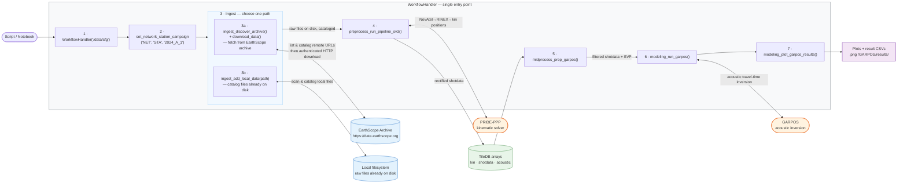
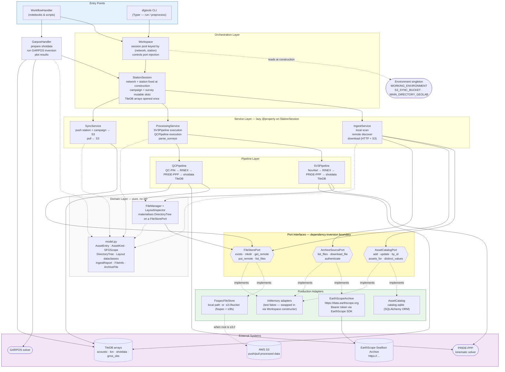

# Architecture

> **Rendering:** Diagrams use [Mermaid](https://mermaid.js.org) syntax. GitHub, VS Code (with the _Markdown Preview Mermaid Support_ extension), JetBrains IDEs, and the [Mermaid Live Editor](https://mermaid.live) all render them natively.

Two perspectives: **[API user](#view-1--api-user-how-a-campaign-gets-processed)** covers the method calls and data flow a user observes; **[contributor](#view-2--contributor-internal-component-structure)** covers the internal layer boundaries, port interfaces, and adapter wiring.

---

## View 1 — API User: How a Campaign Gets Processed

A typical workflow script calls several logical phases in order through a single `WorkflowHandler` entry point. Data can come from the EarthScope archive (remote path) or from files already on disk (local path) — both converge at the pipeline step.

### What each step does

| Step | Method | Produces |
|------|--------|----------|
| 1 | `WorkflowHandler(directory)` | Workspace rooted at `directory`; reads `MAIN_DIRECTORY_GEOLAB` env var if `None` |
| 2 | `set_network_station_campaign()` | Creates campaign & station directories; loads site metadata from archive |
| 3a | `ingest_discover_archive()` + `download_data(kinds=…)` | Catalogs remote URLs then downloads raw files (NovAtel, Sonardyne, CTD, …) into `campaign/raw/` |
| 3b | `ingest_add_local_data(path)` | Scans a local directory and catalogs every recognized file — use when raw data is already on disk |
| 4 | `preprocess_run_pipeline_sv3()` | Converts NovAtel → RINEX, runs PRIDE-PPP, builds kinematic + refined shotdata TileDB arrays |
| 5 | `midprocess_prep_garpos()` | Parses survey shotdata CSVs and applies pre-filters (SNR, DBV, XC, distance, PRIDE WRMS) |
| 6 | `modeling_run_garpos()` | Runs GARPOS inversion; writes results to `campaign/processed/<survey>/GARPOS/results/` |
| 7 | `modeling_plot_*()` | Writes diagnostic plots (residuals, time-series) to the GARPOS results directory |

---

## View 2 — Contributor: Internal Component Structure

The package follows a **ports-and-adapters** (hexagonal) pattern. The domain core never touches the filesystem, database, or network directly — all I/O is delegated through three port interfaces (highlighted in yellow). In tests, adapters are replaced with in-memory fakes; in production, real implementations are injected at `Workspace` construction.

### Layer responsibilities at a glance

| Layer | Classes | Can it do I/O? |
|-------|---------|----------------|
| Entry Points | `WorkflowHandler`, `sfgtools` CLI | No — delegates everything |
| Orchestration | `Workspace`, `StationSession` | No — holds ports, never calls them |
| Service | `IngestService`, `ProcessingService`, `SyncService` | Yes — through ports only |
| Modeling | `GarposHandler` | Yes — calls TileDB + filesystem directly |
| Pipelines | `SV3Pipeline`, `QCPipeline` | Yes — calls PRIDE-PPP, TileDB |
| Domain | `FileManager`, `model.py` | `FileManager` yes (via FileStorePort); `model.py` never |
| Port interfaces | `AssetCatalogPort`, `FileStorePort`, `ArchiveSourcePort` | Protocol definitions — no implementation |
| Adapters | `AssetCatalog`, `FsspecFileStore`, `EarthScopeArchive` | Yes — this is where real I/O happens |

---

## Key design decisions (for contributors)

**Ports-and-adapters boundary.** All three ports are Protocols decorated with `@runtime_checkable`. Pass in-memory fakes at `Workspace(catalog=..., files=..., archive=...)` construction for fully hermetic unit tests — no disk, no network, no SQLite.

**`Environment` singleton.** `WorkflowHandler` and `Workspace` read `WORKING_ENVIRONMENT`, `S3_SYNC_BUCKET`, and `MAIN_DIRECTORY_GEOLAB` from the `Environment` singleton at construction time. No environment variable is threaded through initializer chains — components call the singleton directly when they need a value.

**Session identity.** `StationSession.network` and `StationSession.station` are fixed at construction. TileDB arrays are opened once and held for the session lifetime. Switching campaigns (via `set_campaign`) only touches directory creation and metadata resolution — it never rebuilds arrays.

**Lazy services.** `IngestService`, `ProcessingService`, and `SyncService` are constructed on first access via `@property` on `StationSession`. This keeps construction cheap and avoids circular imports between the session and service modules.

**Pure domain.** `model.py` contains only frozen dataclasses and pure path-math. No imports from services, adapters, or external libraries beyond `upath` and `datetime`. Every layout (`CampaignLayout`, `TileDBLayout`, …) can be instantiated and inspected in tests with zero side-effects.
