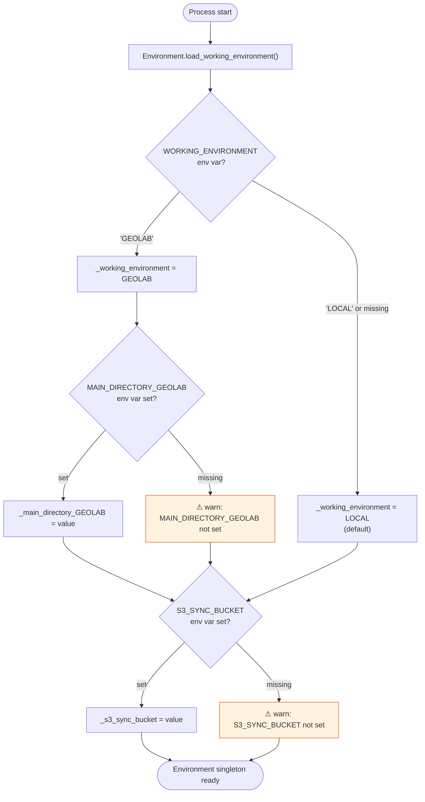
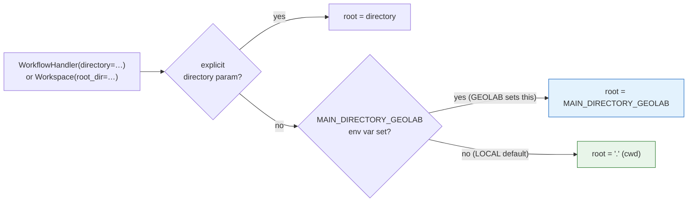
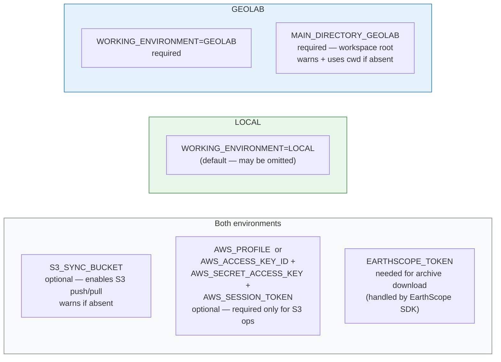
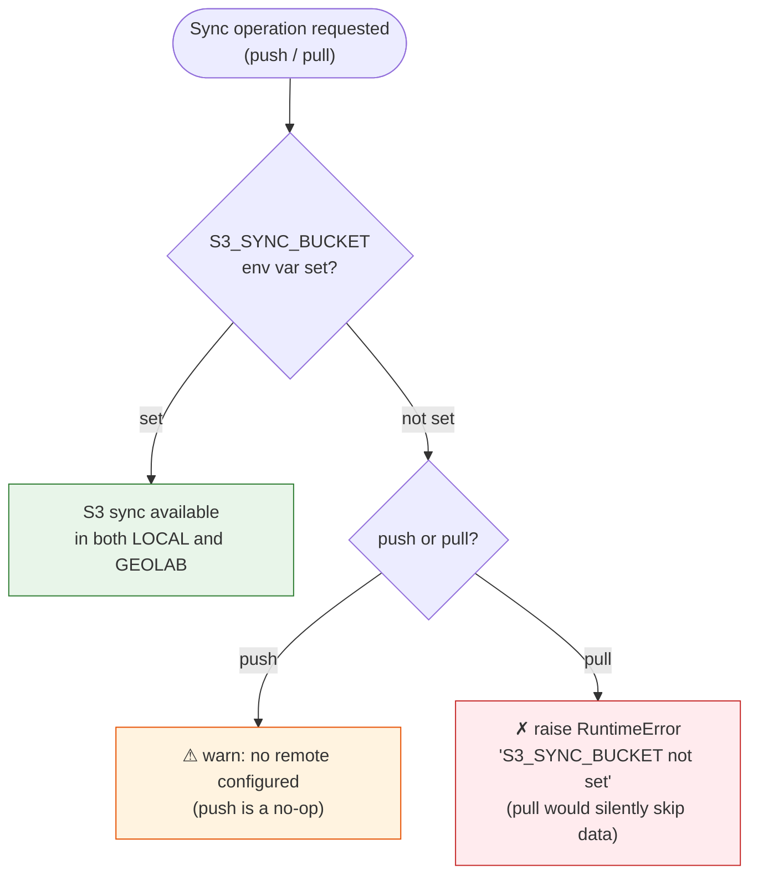
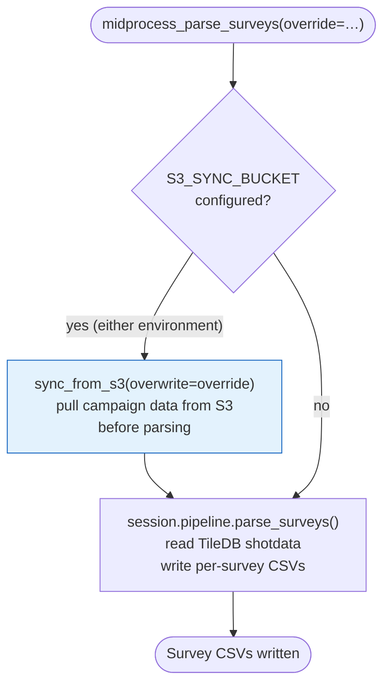

# Environments

> **Rendering:** Diagrams use [Mermaid](https://mermaid.js.org) syntax. GitHub, VS Code (with the _Markdown Preview Mermaid Support_ extension), JetBrains IDEs, and the [Mermaid Live Editor](https://mermaid.live) all render them natively.

The package supports two named environments: **LOCAL** (the default) for developer laptops and local clusters, and **GEOLAB** for the managed EarthScope cloud compute environment. The active environment is read from the `WORKING_ENVIRONMENT` environment variable at startup.

---

## Environment detection

`Environment.load_working_environment()` is called once before any `WorkflowHandler` or `Workspace` is constructed. It reads three environment variables and populates the class-level `Environment` singleton.



---

## Workspace root resolution

The root directory determines where all local data (raw files, TileDB arrays, GARPOS results) is stored. Resolution order is the same for both environments, but GEOLAB pre-populates `MAIN_DIRECTORY_GEOLAB` so the fallback is always used.



### Typical root in each environment

| Environment | Typical root | Set by |
|-------------|-------------|--------|
| LOCAL | Explicit path passed to `WorkflowHandler` | Developer |
| GEOLAB | `$MAIN_DIRECTORY_GEOLAB` | EarthScope cluster config |

---

## Required and optional environment variables



### Variable reference table

| Variable | LOCAL | GEOLAB | Effect when missing |
|----------|-------|--------|---------------------|
| `WORKING_ENVIRONMENT` | Optional (`LOCAL` default) | Must be `"GEOLAB"` | Defaults to `LOCAL` |
| `MAIN_DIRECTORY_GEOLAB` | Ignored | Required | Warning; falls back to `"."` |
| `S3_SYNC_BUCKET` | Optional | Optional | Warning; S3 sync unavailable |
| `AWS_PROFILE` | Optional | Optional | Falls back to explicit key vars |
| `AWS_ACCESS_KEY_ID` / `AWS_SECRET_ACCESS_KEY` | Optional | Optional | Warning if S3 ops attempted |
| `AWS_SESSION_TOKEN` | Optional | Optional | Omitted if not set |

---

## S3 sync behaviour

S3 sync is available in **both** environments — it is gated only on `S3_SYNC_BUCKET` being set, not on the value of `WORKING_ENVIRONMENT`.



#### Auto-sync during mid-processing

`midprocess_parse_surveys()` automatically calls `sync_from_s3()` (pull) if `S3_SYNC_BUCKET` is configured. This is the only workflow step that triggers S3 access without an explicit user call.

---

## Behaviour differences at a glance

| Feature | LOCAL | GEOLAB |
|---------|-------|--------|
| Workspace root source | Explicit param → cwd | `MAIN_DIRECTORY_GEOLAB` env var |
| Archive download | EarthScope SDK (same) | EarthScope SDK (same) |
| S3 push / pull | Available when `S3_SYNC_BUCKET` set | Available when `S3_SYNC_BUCKET` set |
| AWS credential source | `AWS_PROFILE` or key vars (same) | `AWS_PROFILE` or key vars (same) |
| CLI entry point | `sfgtools run` or `sfgtools preprocess` (same) | Same |
| Auto-sync on mid-process | Yes, if `S3_SYNC_BUCKET` set | Yes, if `S3_SYNC_BUCKET` set |

---

## Survey parsing

`midprocess_parse_surveys()` has one environment-sensitive behaviour: it automatically pulls data from S3 before parsing when `S3_SYNC_BUCKET` is configured.  This pull is triggered by the bucket setting, not by `WORKING_ENVIRONMENT` — it happens in both environments.



The parsing logic itself — reading TileDB arrays, filtering, writing CSVs — is identical in both environments.

---

## TileDB arrays and GARPOS

> **Note:** The behaviour described in this section reflects **intended design**, not the current implementation. Neither remote TileDB URIs nor the GEOLAB-only GarposHandler guard are implemented yet.

### Current state

TileDB arrays are always built and opened as **local directories** under `<workspace_root>/<network>/<station>/TileDB/`. The path is derived from `TileDBLayout.for_station()` and is a plain `UPath` rooted at the workspace directory — there are no environment checks and no S3 URI construction anywhere in the array-creation path.

`GarposHandler` has no environment guards and runs identically in both environments.

### Intended design (not yet implemented)

The intended split is:

| Step | LOCAL | GEOLAB (intended) |
|------|-------|-------------------|
| Preprocessing (SV3/QC pipelines) | Build TileDB arrays locally | Build TileDB arrays locally |
| TileDB storage | Local filesystem under workspace root | Remote S3 URI (`s3://bucket/…/TileDB/`) |
| GARPOS modeling | Not intended for production use | Primary use case — open remote TileDB URIs directly |
| GarposHandler guard | Should warn / raise | Unrestricted |

The path to implementing this is:

1. `TileDBLayout.for_station()` would need to accept (or derive from `Environment`) an optional S3 root, producing `s3://bucket/net/sta/TileDB/…` URIs when in GEOLAB.
2. All TileDB array constructors (`TDBShotDataArray`, `TDBKinPositionArray`, etc.) accept `UPath` / `str` already — remote URIs would work as long as TileDB's S3 driver is configured.
3. `GarposHandler` (or `WorkflowHandler.modeling_run_garpos`) could check `Environment.working_environment()` and raise `NotImplementedError` in LOCAL until the feature is complete.

---

## Setup checklists

### LOCAL setup

```
□ Install the package: pip install earthscope-sfg-workflows
□ (Optional) export WORKING_ENVIRONMENT=LOCAL   # this is the default
□ (Optional) export S3_SYNC_BUCKET=s3://your-bucket
□ (Optional) export AWS_PROFILE=your-profile    # or set key/secret/token vars
□ Authenticate with EarthScope SDK for archive access
□ Pass an explicit directory to WorkflowHandler('/path/to/data')
```

### GEOLAB setup

```
□ export WORKING_ENVIRONMENT=GEOLAB
□ export MAIN_DIRECTORY_GEOLAB=/path/to/shared/data   # required
□ (Optional) export S3_SYNC_BUCKET=s3://your-bucket
□ (Optional) export AWS_PROFILE=your-profile           # or key/secret/token vars
□ EarthScope SDK credentials are typically pre-configured in the cluster
□ WorkflowHandler() with no directory arg resolves root from MAIN_DIRECTORY_GEOLAB
```
